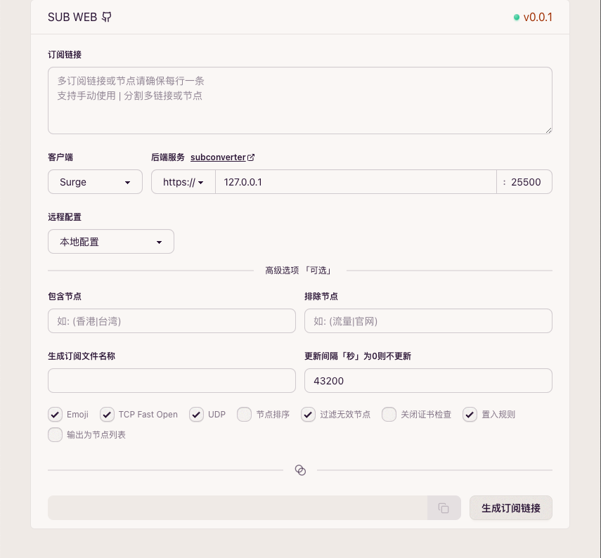

# Sub Web

subconverter's frontend built with Next.js.

[tindy2013/subconverter](https://github.com/tindy2013/subconverter): Utility to convert between various proxy subscription formats.



## ✨ Features

- Responsive UI components
- Form validation with React Hook Form & Zod
- Dark/light mode toggle
- Dockerized deployment

## 🛠 Tech Stack

- ⚡️ Next.js 15
- 🌀 React 19
- 🎨 Tailwind CSS + DaisyUI
- 📘 TypeScript
- 📋 Zod schema validation
- 🏗 React Hook Form
- 🐳 Docker
- 🧁 Bun runtime

## 🚀 Getting Started

### Prerequisites

- Node.js 18+
- Docker (optional)

### Development

```bash
git clone https://github.com/MercuryZz/subweb.git
cd subweb
bun install
bun run dev
```

### Docker installation

```bash
# pull from ghcr.io
docker run -p 3000:3000 ghcr.io/mercuryzz/subweb
# or build from Dockerfile
docker build -t subweb .
docker run -p 3000:3000 subweb
```

## 📝 License

MIT © 2025 MercuryZz
